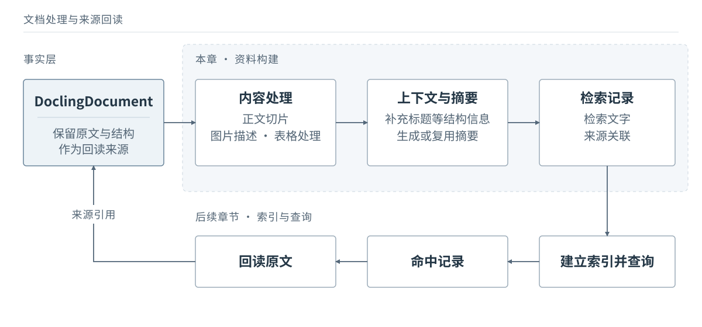

# 004 · Chunk 与增强层：为检索准备资料

简体中文 | 英文译文待补充

上一章：[OCR 与文档解析：一些选择与取舍](003-ocr-and-parsing.md) · [返回总目录](../../README.md#主线教程目录) · 下一章：尚未发布

## 已有完整文档，为什么还需要 Chunk

知识库里保存着完整的项目上线安排，用户却可能只问：“周五夜班由谁负责？”文档里还有上线步骤、回滚条件和检查清单。如果把整篇文档当作一个检索单位，系统即使找到了它，也还需要从多个主题中定位有关的部分。反过来，只留下一个名字，又无法知道他负责哪个项目、哪一天、哪一班。

传统的关键词检索会利用词语匹配寻找相关内容，向量检索则把文字转换为向量，比较语义上的相关性。两者都需要我们先决定：究竟以多大的一份资料参与检索？本章讨论的 Chunk，就是为这个目的组织的内容块。它可以来自一个原文节点，也可以合并多个节点，或者只覆盖一个长节点的一部分。

在这里，我沿用自己的项目习惯，把完整文档作为事实层，另外构建供检索使用的资料。切片之外，还可以补充标题上下文、图片描述和摘要来实现增强，让用户的提问更容易与检索层资料对应。检索结果最后通过来源引用回读原文，让最终回答以事实层原文为依据，避免将 LLM 生成的摘要直接当作事实。这套流程大致如下：



读完本章，你应该能自己决定一份文档如何切片、哪些内容需要增强、如何增强，以及增强结果如何回到来源。前置知识只需要理解文档节点与 JSON 引用。关于检索技术和配套的数据库结构，我们会放到后面单独介绍。

## 如何利用结构切片

固定长度切片利用的是字符或 token 数，句段切片利用标点和段落边界，结构切片还会利用标题、列表、表格等信息。现在已经有了 DoclingDocument，因此我们从它保留的结构出发，再用长度限制调整大小。

各个框架提供了大量切片方式，这里只聊结构感知切片，以及面对不同的数据时，可能需要做哪些调整。这也是结构感知切片的一个优势，你只需要会这一种就够了。

下面以一份虚构的值班文档为例，假定解析和整理后得到以下节点关系。A、B 是两个短段落，C 是一个可能超过切片预算的长段落。

```text
body
└── #/texts/0  星港项目上线与值班安排（文档标题）
    ├── #/texts/1  上线值班（章节标题）
    │   ├── #/texts/2    段落 A
    │   ├── #/texts/3    段落 B
    │   ├── #/tables/0   本周值班表
    │   ├── #/pictures/0 告警升级流程图
    │   └── #/texts/4    图注：告警升级流程
    └── #/texts/5  回滚安排（章节标题）
        └── #/texts/6    段落 C （长）
```

对于正文，我主要复用 Docling 的 HybridChunker。它先使用层级切片结果，再处理超长块，最后在允许时合并相邻的小块。初始块通常对应一个文档元素，不过列表元素等内容可能会被放在一起。

长度调整分两步：能沿文档元素边界拆开的，先在这些边界拆分；单个元素仍然太长时，再进入文本拆分。后者会利用自然文本边界，将一个大段落切散。合并会检查相邻块的标题元数据是否相同，以及合并后的长度是否仍在预算内，同一个层级属于同一个父节点的小块会被考虑合并。

处理结果示意：

```text
段落 A + 段落 B          → text-001（同节、相邻且合并后未超预算）
上线值班 / 回滚安排      → 在章节边界停止合并
段落 C                  → text-002、text-003（预算较小时继续拆分）

text-001 的来源：#/texts/2、#/texts/3
text-002 的来源：#/texts/6
text-003 的来源：#/texts/6
```

我在这套方案中不主动设置固定 overlap，后续回读时会按需扩展邻近内容。不过，结构感知并不能保证语义完全不被切断，尤其是超长段落继续拆分时。回读能够补充已经命中位置的上下文，却无法补救根本没有被召回的资料。

如果项目中存在非常多可能需要被拆分的大文本块，那么去考虑自定义一部分 Hybridruunker 的逻辑，设置一定的 overlap 或者准备一个更好的拆分逻辑是必要的。

此外，Docling 提供了 `contextualize()`，可以为切片补充已有的标题上下文。这与 overlap 是不同的操作：前者补充结构信息，后者重复边界附近的内容，二者并不互斥。如果三级标题对应的切片已记录文档标题和各级章节标题，就可以把这些信息放到正文前面。

## Chunk 多大，以及上下文放在哪里

Chunk 小一些，通常更容易定位到具体内容，但可能把条件和结论分开；大一些，能容纳更多上下文，也可能让无关内容一起参与匹配。我会结合问题长度、答案范围和文档类型选一个起点，再根据实际问题调整。

我的经验起点是：知识库问答约 50–200 token，一般技术文档约 400 token，论文、报告等长文档约 600 token，后两者可以上下浮动约 200。有些财报可能需要 1000 token 甚至更大的切片，具体应结合项目做对照实验。这里的 token 数不是汉字数，需要与所用模型的 tokenizer 对齐。

开始调整时，可以先挑几种不同问题检查切片：找一个负责人、理解完整回滚步骤、确认某条规则的例外条件。不同类型的问题，对应的最优切片大小往往是不一样的，我们需要在工程上找到那个妥协的点。

一段话离开章节以后是否仍然读得懂，也值得检查。Docling 的 `contextualize()` 会将已有标题等元数据与切片正文拼接，返回一段带上下文的文字。假定 `text-001` 的 `meta.headings` 已包含文档标题和章节标题，它处理前后的文字如下：

```text
原始 Chunk.text：
周五上线窗口为 20:00–22:00。超过 22:00 仍未恢复的告警交给夜班。
夜班负责人按本周值班表确认；若负责人暂时无法响应，按告警升级流程联系备班。

contextualize() 后：
星港项目上线与值班安排
上线值班
周五上线窗口为 20:00–22:00。超过 22:00 仍未恢复的告警交给夜班。
夜班负责人按本周值班表确认；若负责人暂时无法响应，按告警升级流程联系备班。
```

## 图片：先判断是否需要额外描述

如果暂时采用文本检索，就需要为图片准备可检索的文字。我在 POPO 项目里先过滤 LOGO 等装饰图片，对有信息价值的图片使用视觉模型生成描述，再结合原有 caption 去形成图片的检索层。

但并不是每张图都要调用模型。AI-PM 项目已有图注，我当时直接使用这些文字，没有再做图片增强。是否需要补充，应看图注是否覆盖了用户可能查询的信息。

Docling 对图片的默认处理，需要分开看解析和切片两个阶段。以标准 PDF 解析流程为例，被识别为图片的内容会保存为 `PictureItem`，并关联识别到的图注和来源位置，但默认不会调用视觉模型生成图片描述。

到了 HybridChunker 这一步，则是把已有内容序列化为文字。图片关联的 caption 会参与序列化，而图片本身的占位文字被设为空，不会把像素内容直接变成可检索的描述。如果没有图注、已有描述等可序列化的文字，结果为空的图片就不会单独生成文本 Chunk，但事实层中的图片节点仍然保留。

如果需要图中的具体内容，就要额外做图片理解。Docling 提供了可选的[图片描述增强](https://docling-project.github.io/docling/usage/enrichments/#picture-description)，可以通过 `do_picture_description` 启用本地或远程视觉模型。生成的文字保存在图片的描述元数据中，兼容路径也会使用注释字段，再由序列化器纳入切片文字。

这里也要区分库的标准操作和本文的分层策略：Docling 可以把生成的描述附加到文档对象，但在我的方案里，这些描述作为派生资料单独保存在增强后检索层中，并关联回原图片，不替换保留原文的事实层。

## 表格：拆行，还是为整表生成入口

规整的长表可以按行切分，并为每块保留表头。HybridChunker 支持在表格超长拆分时重复表头，但具体行为取决于表格序列化及相关配置。这样读到一行数据时，仍能知道每一列的含义。对于很多工程来说，这个默认逻辑已经足够了。

我在 POPO 项目中对排班表和排期表作了另一种选择：保留完整表格，生成整表摘要作为检索入口。有些表格往往需要结合多行、多列理解，哪怕有结构化感知和表头重复，拆开以后也未必好用。

来源为 `#/tables/0`，表名为“本周值班表”，日期范围按正文中的本周理解：

| 日期 | 班次 | 负责人 | 备班 |
| --- | --- | --- | --- |
| 周五 | 夜班 | 林舟 | 赵宁 |
| 周六 | 夜班 | 陈澄 | 赵宁 |

```text
整表摘要示意：星港项目本周周五、周六的夜班安排，
记录各班次的负责人和备班，可用于查找上线后的夜班人员。
来源引用：#/tables/0
```

查询“周五夜班由谁负责”时，我们希望先找到这份资料，再读取表格中的内容。摘要只承担找到表格的工作，具体值仍以原表为准。但这份摘要没有姓名，如果改为按“林舟”查询，就可能漏掉它。此时可以补充重要实体、保留适合检索的表格文字，或者改用按行组织的方案。

所以整表摘要适合哪些表格，需要看查询需求。若主要需求是大量精确筛选、统计和关联查询，我会考虑数据库，而不是不断把业务数据压进摘要里。这部分后面再聊。

## 为 Chunk 补充面向检索的摘要

图表处理结束后，正文 Chunk 还可以生成一份简短摘要。结构上下文说明属于哪里，图表描述提供原本不便直接检索的文字，Chunk 摘要则概括这部分在讨论什么、适用于什么条件。

增强层的摘要与查询时的重写，可以看作同一个问题的两面：一边整理资料的表达，一边整理问题的表达，帮助用户的提问与文档内容对应，尝试改善召回效果。

> 参考提示：根据给出的 Chunk 和标题上下文，概括它讨论的事项、适用范围与限制条件。保留重要人名、时间、编号和否定条件。只使用提供的内容；不确定的内容保持不确定，不补充背景知识或推测结论。

已有描述的图片和表格不必再总结一次，可以复用之前的结果。我比较过只检索摘要、摘要与内容拼接，以及两者分开索引的方式，采用了拼接，但当时没有观察到明显差别。

只检索摘要，文字更集中，也更依赖摘要的信息覆盖；拼接保留了细节，但增加长度，摘要中的错误也会进入检索文本。两者分开索引，则能分别利用主题概括和原文细节，不过需要处理不同入口命中同一份资料的情况。选择之前，先想清楚用户更常按主题找内容，还是按具体实体与条件找答案，这点和 Chunk 大小一样，需要根据场景作出选择。

## 最后交给检索系统什么

下面把 `text-001` 整理成一条供检索使用的教学记录。字段由本文定义，不是 Docling 原生 Schema；`teaching-v1` 表示这份源文档对象的固定快照标识，不是 Schema 版本。

```json
{
  "chunk_id": "text-001",
  "kind": "text",
  "source": {
    "document_id": "xinggang-launch-duty",
    "document_version": "teaching-v1",
    "refs": ["#/texts/2", "#/texts/3"]
  },
  "headings": ["星港项目上线与值班安排", "上线值班"],
  "content": "周五上线窗口为 20:00–22:00。超过 22:00 仍未恢复的告警交给夜班。\n夜班负责人按本周值班表确认；若负责人暂时无法响应，按告警升级流程联系备班。",
  "summary": "周五上线期间的告警交接规则：22:00 后未恢复的告警交给夜班，负责人见本周值班表，无法响应时按告警升级流程联系备班。",
  "summary_origin": "teaching_example",
  "retrieval_text": "星港项目上线与值班安排\n上线值班\n周五上线期间的告警交接规则：22:00 后未恢复的告警交给夜班，负责人见本周值班表，无法响应时按告警升级流程联系备班。\n周五上线窗口为 20:00–22:00。超过 22:00 仍未恢复的告警交给夜班。\n夜班负责人按本周值班表确认；若负责人暂时无法响应，按告警升级流程联系备班。"
}
```

`content` 与 `summary` 分开保存，`retrieval_text` 是“标题路径、摘要、内容”的拼接结果。实际生成时还应记录模型、提示词或构建版本，便于检查与重建。图片和表格记录沿用相同的来源关联思路。

在 Docling 切片结果中，`meta.doc_items` 保存来源节点对象，我们可以取出其中的 `self_ref` 构建这里的引用列表。一个 Chunk 能关联多个节点；长段落拆成两块时，两条记录也可能指向同一个节点。我们后面会再单独聊一聊，如何建模这种关系，实现在数据库中的高效检索与上下文扩展。

增强资料与检索索引单独保存，与事实层保持分离。修改摘要策略时，需要更新受影响的增强资料及索引；如果只更换嵌入模型，通常重新生成向量与对应索引即可，不必重新生成摘要或解析原文件。

到这里，我们已经有了可供检索的文字、来源关联和必要的处理记录。下一篇先假定搜索能力已经就绪，讨论如何召回、聚合和回读这些资料，并生成最终答案；具体的存储与索引组织留到后面单独展开。

## 参考资料与署名

- Docling：[Chunking](https://docling-project.github.io/docling/concepts/chunking/)，关于切片接口、上下文化与表格切片的说明。在线文档可能随版本更新。
- Docling Core 2.91.0：[HybridChunker](https://github.com/docling-project/docling-core/blob/v2.91.0/docling_core/transforms/chunker/hybrid_chunker.py)、[HierarchicalChunker](https://github.com/docling-project/docling-core/blob/v2.91.0/docling_core/transforms/chunker/hierarchical_chunker.py)与[contextualize 实现](https://github.com/docling-project/docling-core/blob/v2.91.0/docling_core/transforms/chunker/base.py)。本章据该版本源码核对行为。

本章原创正文、结构示意与虚构教学内容采用 [CC BY 4.0](../../LICENSE-DOCS)。
