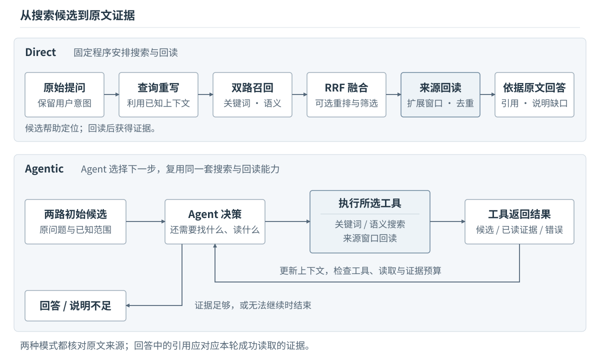

# 005 · 从召回到回答：查询流程与 Agentic RAG

简体中文 | 英文译文待补充

上一章：[Chunk 与增强层：为检索准备资料](004-chunks-and-enrichment.md) · [返回总目录](../../README.md#主线教程目录) · 下一章：尚未发布

## 检索层准备好了，一次查询还要做什么

上一章已经准备了带摘要、上下文和来源关联的增强后检索资料。现在我们根据用户的查询，找到资料，生成回答。

如何选择数据库、怎样实现高效查询，不是这篇文章的重点，这里只简要分享我的习惯。我个人不倾向于使用独立的向量数据库，而是优先考虑在关系型数据库中结合全文检索与向量检索。

根据项目的复杂程度，我一般选择 SQLite 或 PostgreSQL。它们都具备全文检索能力，也可以分别通过 sqlite-vec 和 pgvector 扩展提供向量检索。这样还能复用关系型数据库已有的查询能力。后面会单独设计一套数据表结构，方便我们高效地从增强层回到事实层。

这里默认检索层和搜索能力已经存在，我们只讨论如何使用它们。先走一遍固定程序控制的 Direct 流程，再看 Agent 如何决定下一次搜索与读取。两种方式都沿用我在项目中的习惯：检索资料帮助定位，回答回到原文。



## 查询重写是增强层摘要的另一面

资料写的是“告警交接”“夜班负责人”，用户说的是“晚上出了问题找谁”。关键词检索可能无法直接对应这些表达，语义检索也不一定能补足被省略的项目名称。在我做的专业知识库里，查询重写（Query Rewrite）是值得优先考虑的一步，具体怎么改写，需要结合项目中的术语和提问习惯。

这与上一章的摘要增强相互配合。一边把资料整理成容易被查询到的文字，另一边把用户的话转成资料库中更常见的表达。Query Rewrite 不需要回答问题，它的任务是保留用户意图，补全已知上下文，给搜索准备输入。

在本章的 Direct 流程里，我采用一次重写，得到自然语言查询以及关键词、短语两种表达，不默认拆成大量子问题。对于有专业术语和内部简称的知识库，可以进一步处理别名、指代和领域表达，但重写往往有效，但依旧取决于它有没有解决实际的表达差异。

下面的 JSON 只是重写结果示意。

```json
{
  "original_query": "周五晚上出了问题找谁？",
  "known_context": "星港项目；值班文档所指的时间为本周",
  "semantic_query": "星港项目本周周五晚间发生故障或告警时，应联系谁，值班和交接如何安排？",
  "keywords": ["星港项目", "周五", "夜班", "告警", "负责人", "交接"],
  "phrases": ["值班安排"]
}
```

这里可以把“出了问题”联系到“故障或告警”，把“找谁”联系到“负责人”。重写应保留用户的原始意图，在已知上下文中补全指代、调整术语或提取关键词，不能悄悄改变问题的对象和限制条件。否则，后面的搜索即使命中，也可能是在回答另一个问题。无论怎样使用重写后的内容，原始问题都需要保留，供回答时对照用户原意，正如事实层与检索层的分离一样。

请求失败或结果明显偏题时，Direct 可以退回原始问题继续搜索，并记录这次回退，避免一个辅助步骤让整条查询中断。至于重写有没有帮助，需要结合候选结果比较。我会准备一组覆盖实际问题的评测样例，检查重写前后的变化，再逐步调整规则。

## 两路召回，怎样变成一份候选名单

### 关键词与语义，分别在找什么

关键词检索根据查询词与资料文字的匹配寻找候选，适合利用名称、编号和明确术语；BM25 等排序方法还会考虑词频、词的区分度和资料长度。这类检索主要依赖文本拆分、归一化与匹配规则，不像嵌入模型那样通过向量表示语义关系。数据库中的 FTS（Full Text Search）是全文检索的统称，具体实现的算法略有差异。

向量检索把查询表示成与资料向量可比较的向量，根据相似度或距离寻找候选。嵌入模型（Embedding Model）将文本编码为向量，训练目标通常是让相关文本在选定的相似度度量下更接近。不过，这种相关性判断仍可能出现偏差。不同模型即使输出维数相同，也不意味着向量可以直接比较，因此还需要根据项目的语料与问题选择合适的模型。

查询向量要使用与资料索引配套的模型和处理方式，包括模型要求的查询侧输入格式。用户已经明确的项目、日期等约束也要传递下去：搜索支持对应过滤时就利用它，返回后仍要核对适用范围，不应把这些条件全部交给语义相似度判断。

召回的目标，是先形成值得进一步读取的候选集合，降低后面高成本处理方案的消耗。每路返回候选标识、来源定位和自己的排序信息，后续需要经过整理后再考虑哪些应该被利用。

### 用名次融合两份结果

两路原始分数的含义和范围不同，不能直接相加。我习惯使用 RRF（Reciprocal Rank Fusion）合并排名。它只利用候选在每一路的名次，将各路贡献加起来，分数越高越靠前。[原始论文](https://cormack.uwaterloo.ca/cormacksigir09-rrf.pdf)中的形式如下：

$$
\operatorname{RRF}(d)=\sum_{r\,\text{包含}\,d}\frac{1}{k+\operatorname{rank}_r(d)}
$$

名次从 1 开始。本文对有限候选列表计算，某一路没有返回这条记录，就不贡献分数。`k` 是平滑常数，用于缓和靠前名次之间的贡献差距，与每路返回的候选数量是不同参数。下面取 `k = 60`，两路各展示前三名：

| 检索记录 | 内容主题 | 关键词名次 | 语义名次 | RRF 分数（约） |
| --- | --- | --- | --- | --- |
| `text-001` | 上线告警交接规则 | 2 | 1 | 0.032522 |
| `table-001` | 本周值班表摘要 | 1 | 3 | 0.032266 |
| `picture-001` | 告警升级流程图注 | 未返回 | 2 | 0.016129 |
| `text-002` | 回滚操作 | 3 | 未返回 | 0.015873 |

例如 `text-001` 得到 `1/62 + 1/61`。如果本次只保留前两条，它与 `table-001` 就进入下一阶段。

同一记录在两路出现时只保留一个候选，并累加贡献。不同 Chunk 即使指向相同原文，在这里仍可能是不同检索入口，回读时再对重复来源去重。一个系统同时需要这两种去重，避免大量的重复上下文塞爆整个系统。

POPO 通常每路取约 30 条，AI-PM（Lenny Compass）每路最多取 60 条，融合后都保留 12 条。这是不同项目的经验参数。候选太少可能提前漏掉资料，太多会增加后续处理量；还要结合单条资料大小与最终证据预算来调整。如果两路都为空，可以检查查询表达，或者回到资料构建阶段排查问题。

### 是否还需要 Rerank

RRF 没有重新阅读问题和候选，Rerank 则进一步判断它们的相关性。我基本已经不再部署独立的重排模型，如果需要重排，我会用一次单独的 LLM 请求处理，这也是我使用通用模型的一种方式。

在我的工作习惯中，RRF 是默认步骤，重排是可选步骤，放在融合得到候选池之后、选取回读对象之前。重排会增加延迟和调用成本，也可能过度偏好写得流畅的摘要。它重新排列的是已有候选，无法找回召回阶段完全漏掉的资料。重排决定优先读取哪些候选，回读负责获得原文证据，它们都不能解决在召回阶段漏掉资料的问题。

在我目前的项目里，我会先优化召回覆盖、来源回读和 Agent 的工具使用，暂不优先考虑 Rerank。如果候选噪声较大，或者读取预算很紧，再评估重排是否值得引入。

## 命中了记录，为什么还要回读原文

增强后的 Chunk 可能遗漏原文信息，模型生成的摘要也可能引入幻觉。如果直接基于这些检索资料回答，就可能漏掉原文中已有的事实，或者把生成内容误当成事实。这就是我一直把来源关联保留到查询阶段的原因。

下面展示 `table-001` 的来源定位。这是教学记录，不是数据库表结构。`L-table` 是该来源定位的示例别名；后文的 `L-text` 指向同一文档、同一版本中的 `#/texts/2` 和 `#/texts/3`。

```json
{
  "chunk_id": "table-001",
  "locator": "L-table",
  "source": {
    "document_id": "xinggang-launch-duty",
    "document_version": "teaching-v1",
    "refs": ["#/tables/0"]
  },
  "retrieval_text": "星港项目本周周五、周六的夜班安排，记录各班次的负责人和备班，可用于查找上线后的夜班人员。"
}
```

回读先定位对应版本的文档对象，再解析来源节点，最后拿到实际原文。表格入口对应完整表格；`text-001` 对应两个正文节点。只有完成这一步，才能为读取结果分配证据标识，供回答引用。

一个 Chunk 指向多个节点，或多个 Chunk 指向同一节点，都应按照来源关联处理，不能假设它们一一对应。

检索单位小一些有利于定位，但回答往往需要周围的条件。这种先找到小块、再读取更大上下文的方式通常叫 Small to Big。

固定 overlap 能补充部分边界内容，而结构关系允许我们更有针对性地选择上下文。在我的结构感知切片方案里，Small to Big 是重要的一步。既然保留了这些关系，就应该考虑怎样利用它们，而不是只读命中的那一小块。

对于 DoclingDocument，可以考虑下面三种 Small to Big 方式：

- 沿阅读顺序设置上下文窗口（window），扩展邻近内容。
- 读取子节点，以及通过图注等引用关联的补充内容。
- 回到父节点，按需读取章节上下文或相关兄弟节点。

这里涉及阅读顺序、父子关系和图注引用，不能全部当作 `children` 关系处理；查找邻近内容时，也不能简单对 `self_ref` 末尾的数字加减。

*相关数据库具体方案会有单独的一篇详细解释。*

Direct 可以按预设规则自动扩展。本例命中表格和交接段落后，窗口可能重叠，应按文档、版本与节点去重。如果扩展后的内容超过长度预算，还需要裁剪，并检查是否保留了回答所需的条件。

下面是从候选定位到引用回答的简短示例。`E01`、`E02` 是本轮读取结果的证据标识，具体表格和段落会在后面的工具返回示例中展示：

```text
table-001 → L-table → teaching-v1 的 #/tables/0 → E01（完整值班表）
text-001  → L-text  → teaching-v1 的 #/texts/2、#/texts/3 → E02（交接段落）

回答示意：
周五夜班负责人是林舟，备班是赵宁。[E01]
文档明确，超过 22:00 仍未恢复的告警交给夜班；
负责人无法响应时，按告警升级流程联系备班。[E02]
对于 20:00–22:00 上线窗口内首先联系谁，这些资料没有明确说明。
```

来源可追溯也不等于内容永远正确。两份材料如果给出冲突安排，应把冲突展示出来，结合适用日期和版本说明范围。没有足够依据时，就保留缺口，而不是让模型填上一个看似合理的答案。

诚实地说明自己不知道，在知识系统中比编出一个看似合理的答案更好。

## Agentic RAG：把下一步交给 Agent

Direct 按固定流程执行一次重写、双路搜索、融合、回读和回答。对于资料集中、一次就能找到依据的问题，它已经够用。但如果第一次只找到值班表，读完之后才发现还不知道什么时候交班，系统就需要决定是否继续搜索。

Agentic RAG 将这类决定交给 Agent：下一次搜什么，用哪种搜索，读哪条来源，窗口多大，以及什么时候停止。在前面提到的 Lenny Compass 项目里，我先把关键词和语义两路的少量候选分别交给 Agent，之后由它选择动作，不再在后台自动执行 Direct 中的重写、RRF 或重排。

Agentic RAG 也可以把混合检索封装成一个工具，工具内部照样做融合。关键在于谁控制下一步，以及依据什么信息作出决定。多轮搜索和读取，可以看作在查询时增加计算、尝试改善回答的一种方式（test-time scaling）。

### 搜索工具与读取工具

本篇只需要三类能力：`search_keywords` 查关键词，`search_semantic` 查语义，`read_source_window` 按定位读取原文。

仍用“周五晚上出了问题找谁”走一遍。初始化阶段将原始问题和已知项目范围交给两路搜索，各取少量候选，分别展示给 Agent。为说明补查的作用，这里假定未经重写的初始查询只找到了值班表，两路都尚未召回交接规则；它与前面 Direct 重写后的候选示意不同。

```json
{
  "initial_calls": [
    {"tool": "search_keywords", "query": "周五晚上出了问题找谁？", "context": "星港项目，本周"},
    {"tool": "search_semantic", "query": "周五晚上出了问题找谁？", "context": "星港项目，本周"}
  ],
  "candidate_excerpt": {
    "keyword": [{"chunk_id": "table-001", "locator": "L-table", "topic": "本周值班表"}],
    "semantic": [{"chunk_id": "table-001", "locator": "L-table", "topic": "本周值班表"}]
  }
}
```

两路都返回了值班表，Agent 只需读取一次。这里的 `radius: 0` 表示只读定位指向的内容，不额外展开邻居；由于该定位对应整张表，表格仍完整保留。

```json
{
  "call": {"tool": "read_source_window", "locator": "L-table", "radius": 0},
  "result": {
    "evidence_id": "E01",
    "locator": "L-table",
    "rows": [
      {"日期": "周五", "班次": "夜班", "负责人": "林舟", "备班": "赵宁"},
      {"日期": "周六", "班次": "夜班", "负责人": "陈澄", "备班": "赵宁"}
    ]
  }
}
```

此时已经知道夜班人员，但表里没有交接时间，初始候选中也没有交接规则。Agent 可以扩大原文读取范围，也可以再次搜索。本例选择后者，用更明确的问题补查适用条件。这种根据已读信息调整查询表达的做法，就是动态的查询重写。如果交接规则已经在候选中，就可以直接读取，不需要多轮重复搜索。

```json
{
  "call": {"tool": "search_semantic", "query": "星港项目本周周五晚间告警什么时候交给夜班，负责人无法响应时怎么办？"},
  "result": [{"chunk_id": "text-001", "locator": "L-text", "topic": "上线告警交接规则"}]
}
```

搜索依然只返回候选，Agent 要再读一次，才能将里面的时间条件放进回答。

```json
{
  "call": {"tool": "read_source_window", "locator": "L-text", "radius": 0},
  "result": {
    "evidence_id": "E02",
    "locator": "L-text",
    "text": "周五上线窗口为 20:00–22:00。超过 22:00 仍未恢复的告警交给夜班。\n夜班负责人按本周值班表确认；若负责人暂时无法响应，按告警升级流程联系备班。"
  }
}
```

每次工具返回结果都加入本轮上下文，Agent 据此判断还缺什么。这轮已经能生成前面的带引用回答，同时说明上线窗口内联系人的缺口。如果缺口对用户很重要且还有预算，可以继续找相关安排；如果后续搜索没有新资料，就停止并明确没有找到，Loop 需要一个终点。

### 让循环有结束条件

我会分别限制工具轮数、来源读取次数和累计证据 token 数。它们控制不同开销：重复改写查询可能消耗很多轮，却没有读到新内容；一次读取长表格，也可能迅速耗尽证据预算。

这些预算由执行工具的程序检查，不能只在提示词里要求 Agent 节制。继续行动前要知道还剩多少预算；读取失败要带着错误返回，让它判断是否换一个来源。

我把这些程序约束作为兜底，同时让 Agent 在预算内主动判断何时结束。连续搜索没有新增候选或证据时，就应该考虑是否还有继续搜索的必要，而不是等到预算耗尽才停止。

如果预算耗尽时仍未核实适用范围，回答应明确说明这一点。证据足够时提前结束，证据不足时给出有限回答或说明无法回答，预算耗尽不应自动让候选摘要变成证据。

最后检查引用是否确实来自本轮成功读取的证据，再检查它是否支持对应句子。前者可以检查标识和读取记录，后者仍需判断内容。Agentic 的自由主要在查询过程，两种模式最后都要面对同一个问题：这句话到底依据了哪一段原文？

## 常见的查询故障与检查

一次回答错误，可以发生在不同位置。我更愿意先定位失败的阶段，再决定是否加工具、调参数或换模型。为整个 RAG 系统保留完整的调用轨迹（trace），有助于回答下面的问题，并根据使用中暴露的问题持续迭代。

- 重写是否改变了问题，丢掉日期、对象或否定条件？
- 必要资料是否进入至少一路候选，还是两路都没有找到？
- 资料是否在融合、截断或重排后被丢掉？
- 回读是否找到正确版本，窗口是否覆盖了条件和结论？
- 回答引用是否来自本轮已读证据，证据是否支持那句话？

例如，只索引表格摘要时，按人名搜索可能漏掉表格，这是候选覆盖问题；表格已返回，却在融合后被截掉，是筛选问题；读到了表格仍把周六负责人说成周五负责人，则是读取后的理解或生成问题。搞清楚这些问题，才知道下一步应该去做什么。

记录原始问题、实际搜索表达、分路候选与排名、保留名单、读取的来源版本及证据、最终引用，同时记录各阶段耗时和调用量。这些信息组成查询过程的 trace，帮助我们区分“没有找到”“找到但没读到”和“读到但答错”。

服务规模上升以后，还需要在成本和收益之间找到平衡。并不是所有任务都应该使用预算拉满的 Agentic RAG；将召回、回读和回答的细节优化好，Direct 模式也可以取得不错的效果。

到这里，查询流程已经能把检索记录变成有来源的回答。后续设计存储和接口时，就可以围绕这些实际动作展开。

## 参考资料与署名

- G. V. Cormack、C. L. A. Clarke、Stefan Büttcher：[Reciprocal Rank Fusion outperforms Condorcet and individual Rank Learning Methods](https://cormack.uwaterloo.ca/cormacksigir09-rrf.pdf)，SIGIR 2009。用于核对 RRF 公式与平滑常数的含义，本文排名表为原创教学演算。
- [SQLite FTS5](https://www.sqlite.org/fts5.html) 与 [PostgreSQL 全文检索](https://www.postgresql.org/docs/current/textsearch-controls.html)，关于全文检索和排序方式的说明。
- [sqlite-vec](https://alexgarcia.xyz/sqlite-vec/) 与 [pgvector](https://github.com/pgvector/pgvector)，分别为 SQLite 和 PostgreSQL 提供向量检索扩展。
- Sentence Transformers：[Retrieve & Re-Rank](https://www.sbert.net/examples/sentence_transformer/applications/retrieve_rerank/README.html)，关于召回与重排各自作用的说明。

本章原创正文、SVG 与虚构教学内容采用 [CC BY 4.0](../../LICENSE-DOCS)。
